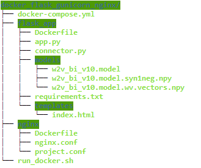

# Template to configure flask + gunicorn + nginx + docker
Check other [repository](https://github.com/deekshakoul/Production-Deployment-ML-Model) for deployment using flask, gunicorn and nginx

### Folder structure ###



<details><summary> Step 1 - installing docker and docker-compose </summary>

> [Docker installation](https://docs.docker.com/engine/install/ubuntu/\#install-using-the-repository)
> [Install Compose on Linux systems](https://docs.docker.com/compose/install/\#install-compose-on-linux-systems)

```
[Docker installation](https://docs.docker.com/engine/install/ubuntu/\#install-using-the-repository)
[Install Compose on Linux systems](https://docs.docker.com/compose/install/\#install-compose-on-linux-systems)
```
  
</details>


<details><summary>Step 2 - Docker image for Flask </summary>
  
```
.
├── flask_app 
   ├── app.py          
   ├── connector.py
   ├── models/
   ├── templates/
   └── **Dockerfile**
```
 
* Create a flask app - app.py, a WSGI interface - connector.py.
* A model folder that contains files related to your ML model and templates folder that conatins index.html which renders UI fro our ML model.
* Both the above points have already been covered [here.](https://github.com/deekshakoul/Production-Deployment-ML-Model)  
* New thing - Dockerfile
  * Create a docker image for flask - Dockerfile
  * Create a requirements.txt that will cotain all the packages that need to be installed - flask, gunicorn, gensim.
</details>

<details><summary> Step 3 - Web container(Nginx web server)  </summary>
 
```
├── nginx
   ├── nginx.conf          
   ├── project.conf
   └── Dockerfile  
```
 * nginx.conf - basic configuration setup file of nginx( can be found in /etc/nginx/)
 * project.conf - this is our nginx config setup file. Quite similar to what was done in earlier [repo](https://github.com/deekshakoul/Production-Deployment-ML-Model). The change to note here is argument **proxy_pass** which is set now as ` http://flask_app:8000;`, thus, pointing your Nginx configuration to the flask project. Since the flask container is called flask_app (in Step 2.)
   * This file also metions the port at which finally our app will run i.e port 80.
 * Dockerfile - Deletes the default config files of nginx and replace it our nginx.conf and proj.conf
</details>


<details><summary>Step 4 - Setting up docker-compose </summary>
 
We have 2 Dockerfiles: one for Flask + Gunicorn, and another for Nginx, inorder to communicate between them, we create a docker-compose.yaml file in our main folder.<br/>
* The docker-compose file has two services -  flask_app and nginx.
* flask_app executes gunicorn that eventually runs our flask app and translates to port 5000
* nginx conatiner runs on port 80 and is dependent on launch of flask_app first.
* In both services, have added **image** as docker_hub_id/<repo_name>. This will be useful when we push these container to our docker hub repo.

</details>


<details> <summary> Step 5 - Running docker set-up</summary>

 ```
docker-compose rm -fs
docker-compose up --build -d
```
- [ ] Run by `bash run_docker.sh`
- [ ] We have succesfully dockerize the container and its good to run on server_ip:80. 
- [ ] Now will move ahead to see how you can deploy docker to any other server.
</details>

<details><summary> Step 6 - Pushing our images to docker hub </summary>
 
 * Create a account on docker hub and note your docker_hub_id
 * login docker hub in your server via `sudo docker login -u "user_id" -p "password" docker.io`
 * sudo docker-compose push
      * There will be two repos create in your  docker_hub_id namely fask_app and nginx, that is why it was import to set "image" argument in docker-compose.
 </details>
 
<details><summary> Step 7 - Running dockerized ML model on another server </summary>
 
 - [ ] login to new server and install docker and docker-compose from Step 1.
 - [ ] login in docker hub from this server
 - [ ] sudo docker-compose pull
 - [ ] create a newfolder and create a new docker-compose.yaml file for this server. This file will not be same as we used earlier, this one would be really simple that would just instruct docker to run the named services on ports mentioned. I have added this file as well under new_server folder. Notice there are no **builds, restart** arguments in this file.
 - [ ] sudo docker-compose up 
 
 > **Finally, our app will now run at new_server_ip:80** 

- [ ] Following commands can be run to restart fresh docker-compose:
```
sudo docker-compose stop
sudo docker-compose rm -f
sudo docker-compose pull   
sudo docker-compose up 
```
 
 </details>
 
<details><summary> Step 8 - References </summary>

* [How to deploy ML models using Flask + Gunicorn + Nginx + Docker](https://towardsdatascience.com/how-to-deploy-ml-models-using-flask-gunicorn-nginx-docker-9b32055b3d0)
* [Downloading images with docker-compose](https://medium.com/analytics-vidhya/how-to-understand-downloading-images-with-docker-compose-236e323e541) 
 
